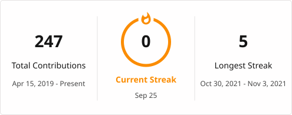

<p align="center">
<a href="https://github.com/ACodingDay"></a>
</p>

<p align="center">
<a href="https://leetcode-cn.com/u/iamyyt/"></a>
<a href="mailto:yinshuaibi@gmail.com"></a>
</p>

---

## 📊 本周编程

 <!--START_SECTION:waka-->

```txt
Erlang     30 hrs 30 mins        ██████████████████████▓░░   90.02 %
Other      1 hr 13 mins          █░░░░░░░░░░░░░░░░░░░░░░░░   03.61 %
Markdown   55 mins               ▓░░░░░░░░░░░░░░░░░░░░░░░░   02.75 %
Bash       54 mins               ▓░░░░░░░░░░░░░░░░░░░░░░░░   02.66 %
PHP        17 mins               ▒░░░░░░░░░░░░░░░░░░░░░░░░   00.87 %
```

<!--END_SECTION:waka-->

---

## 👨‍💻 信息统计

[](https://github.com/ashutosh00710/github-readme-activity-graph)

<table>
  <tr>
    <td></td>
    <td><a href="https://git.io/streak-stats"></a></td>
  </tr>
</table>

---

## 📌 技能

**Languages**

<p>


</p>

**Frameworks & Databases**

<p>


</p>

**OS & Environments**

<p>


</p>

**Tools**

<p>


</p>

---